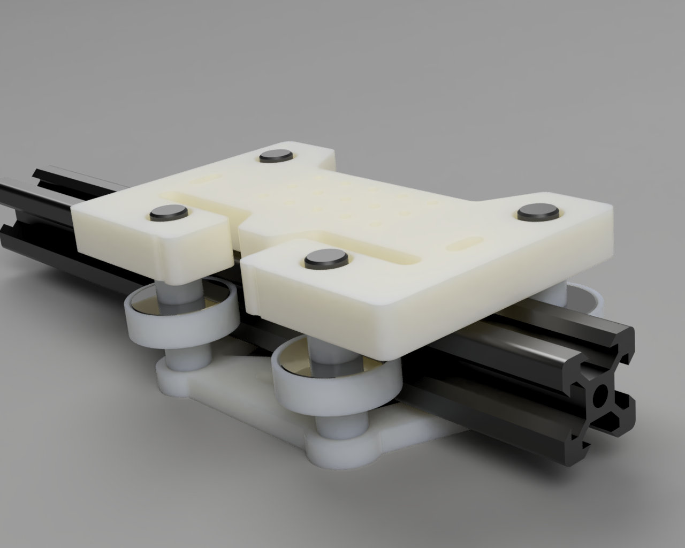
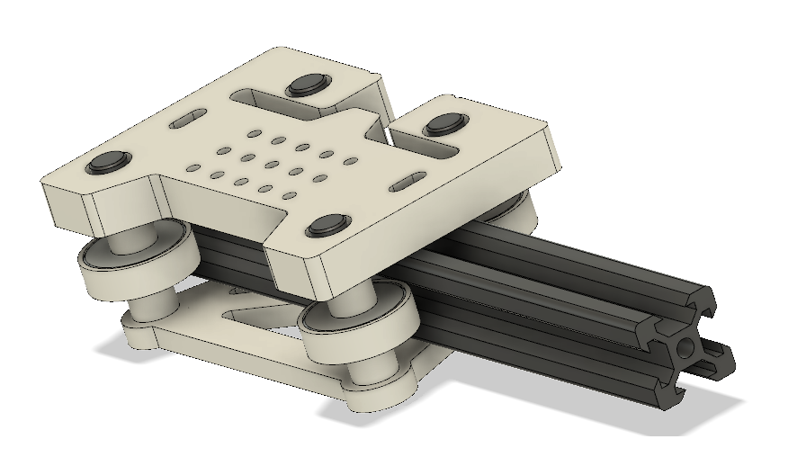
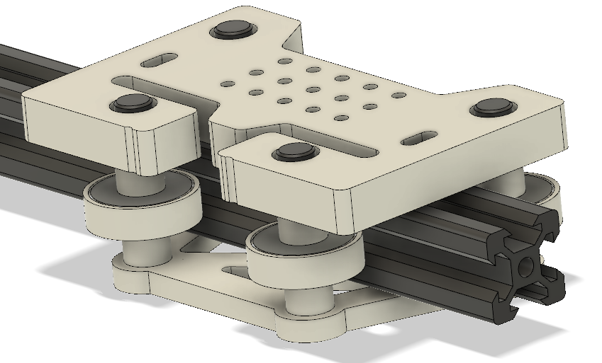

# V-slot-Gantry
An Open-source parametric Gantry for creating CNC machines from V-slot Aluminum profiles and bearings.

Any CNC machine is a collection of motion systems held together by rigid joints and actuated by positon controlled electronics. The accuracy and repeatability of the machine depends on the quality of the motion systems.

A motion system in simple terms is constraining decrees of freedom, to the one we want. There are many ways to do this, from rollers to sliding joints to linear bearings. 

The V-slot aluminum profile developed by Openbuilds is a good profile for contraining motion using bearings. The profile has V-slots on all four side running paralell to the length. These slots provide channels for the rollers to run, since the edges are sloping, there is minimal slipping in the lateral direction.

Aluminum profiles come in various sizes namely 2020,2040,3030 etc. These represent the outer dismensions of the profile. This gantry is designed for 2020 profile, but the design is paramteric and can be modified to include various sizes.

This gantry design is very minimal and provides adequate rigidity to be used as an axis for a CNC machine. It requires very minimal hardware.

### BOM

1. 10mm HDPE (PP Sheets would also work)
2. 5mm HDPE
3. 608zz Bearings
4. SHCS M5X35

Most of the spacers used in the gantry and milled using a CNC mill from 10mm HDPE.

There are 3 spacers of various height, OD, and same ID,
	1. Between top plate and bearing.
	2. Between M5 Screw and bearing ID.
	3. Between bottom plate and bearing.

